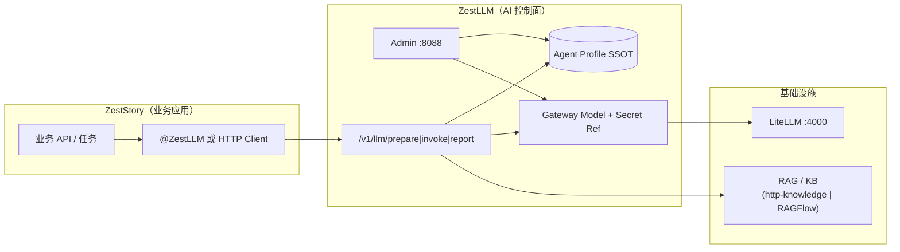

# ZestStory × ZestLLM 接入报告

**文档版本**：2026-06-14  
**ZestLLM 基线**：`origin/master` @ `01facd3`（Integration Suite v1.2 + 内嵌 UI + Webhook 冒烟）  
**适用读者**：ZestStory 后端 / 架构 / 运维  
**用途**：放入 ZestStory 仓库，作为第一期 dogfood 落地与联调依据  

---

## 1. 结论（能否开干）

| 问题 | 答案 |
|------|------|
| 现在能否启动 ZestLLM + LiteLLM 接 ZestStory？ | **可以** |
| 是否需要在 `zest-llm` 写 ZestStory 业务？ | **不需要**（零耦合；业务只在 ZestStory 仓库） |
| RAG 是否必须？ | **否**；POC 可先 small（无 RAG），检索场景用 medium `http-knowledge` 或 large RAGFlow |
| ZestLLM 本地验收是否闭环？ | **是**（79 PASS / AC57–67；内嵌 UI + Webhook 7 PASS） |
| 还缺什么？ | Linux Docker **生产签字**（不影响 ZestStory 开发联调） |

**推荐策略**：ZestStory 作为 ZestLLM 第一个外部消费者（dogfood），按 Integration Suite 标准路径接入，不在 middleware 仓库写网文逻辑。

---

## 2. 架构关系



| 角色 | 职责 |
|------|------|
| **ZestLLM** | Prompt 渲染、模型路由、Profile 治理、Probe/Eval 门禁、FinOps、Import API |
| **LiteLLM** | 统一模型网关（上游 DeepSeek/OpenAI 等） |
| **RAG 服务** | 知识检索（可选；由 Profile `extensions.knowledge` 配置） |
| **ZestStory** | 网文/平台业务、调用控制面、消费 `renderedPrompt` / `answer` |

---

## 3. ZestLLM 当前交付能力（与接入相关）

| 模块 | 能力 | ZestStory 用途 |
|------|------|----------------|
| ① SSOT + Import | Gateway Model、Secret Ref、批量 Import、LiteLLM 同步 | 模型与密钥统一登记 |
| ② 集成指南 | `docs/ZestLLM-第三方集成指南.md` | 45 分钟接入路径 |
| ③ SPI | `http-knowledge`、noop、RAGFlow/Dify（large） | 章节/设定检索 |
| ④ 治理 | Publish Preview、Webhook + DLQ、Integration 概览 UI | 发布审批、变更通知 |
| Runtime | `POST /v1/llm/prepare|invoke|report` | 业务主调用链 |
| Starter | `zest-llm-starter` `@ZestLLM(code)` | Java 业务最简集成 |

**Admin 集成页**（内嵌 UI）：`http://127.0.0.1:8088/integration`  
**验收脚本**：`deploy/scripts/full-acceptance.ps1`（79 PASS，含 AC57–67）

---

## 4. 推荐 Tier 与 RAG 选型（ZestStory 分期）

| 阶段 | Tier | 模型 | 知识 | 启动方式 |
|------|------|------|------|----------|
| **P0 POC** | small | LiteLLM mock / 单模型 | `knowledge.enabled: false` | Windows：`start-local-full.ps1 -EmbedUi -WithLiteLLM` |
| **P1 检索** | medium | LiteLLM + 真模型 Secret | `http-knowledge` → ZestStory 或自建 KB HTTP | Admin 配置 `zest.llm.http-knowledge.base-url` |
| **P2 完整 RAG 栈** | large | LiteLLM sync 全量 | RAGFlow / Dify-KB | Linux Docker：`zest-stack-up.sh large` |

**http-knowledge 配置示例**（ZestLLM Admin `application-local.yml` 或 Helm values）：

```yaml
zest.llm.adapters.knowledge-retrieval: http-knowledge
zest.llm.http-knowledge:
  base-url: http://your-kb-host:8090
  retrieve-path: /v1/retrieve
  health-path: /health
```

Profile 参考：`examples/integration/generic-hybrid-rag/profile.yaml`。

---

## 5. 环境启动（联调最小集）

### 5.1 Windows 本地（已验证）

```powershell
# 生产形态：内嵌 UI + LiteLLM mock + Webhook mock（可选）
powershell -File deploy/scripts/start-local-full.ps1 -EmbedUi -WithLiteLLM

# 需要 Webhook 联调时
powershell -File deploy/scripts/start-local-full.ps1 -EmbedUi -WithLiteLLM -WithAlertMock

# 冒烟
powershell -File deploy/scripts/verify-embedded-ui-and-webhook.ps1
powershell -File deploy/scripts/full-acceptance.ps1
```

| 服务 | 地址 | 默认账号 |
|------|------|----------|
| Admin（内嵌 UI） | http://127.0.0.1:8088 | admin / admin123 |
| LiteLLM | http://127.0.0.1:4000 | `sk-zest-llm-demo` |
| Webhook mock | http://127.0.0.1:8090/webhook | `-WithAlertMock` 时 |

**前置**：MySQL 8 本地 `:3306`，库 `zest_llm`（Flyway 自动迁移至 V24+）。

### 5.2 跨仓 E2E（ZestStory + ZestLLM，Windows 已验证 2026-06-14）

```powershell
# 终端 1 — ZestLLM + KB mock
cd zest-llm
powershell -File deploy/scripts/start-kb-mock-local.ps1
$env:ZEST_LLM_ADAPTERS_KNOWLEDGE_RETRIEVAL = "http-knowledge"
$env:ZEST_LLM_HTTP_KNOWLEDGE_BASE_URL = "http://127.0.0.1:8091"
powershell -File deploy/scripts/start-local-full.ps1 -WithLiteLLM -SkipBuild

# 终端 2 — ZestStory（MySQL + Redis 本地 :3306/:6379）
cd ..\zestory
mvn -pl zestory-admin spring-boot:run

# 终端 3 — 冒烟
cd ..\zest-llm
powershell -File deploy/scripts/e2e-zeststory-zestllm.ps1 -SkipStart
```

| 用例 | 说明 | 期望 |
|------|------|------|
| E2E-01 | Admin `/v1/llm/invoke` · `zestStoryInvoke` | PASS |
| RAG-01 | Admin `/v1/llm/invoke` · `zestStoryRag` + http-knowledge | PASS |
| E2E-02 | ZestStory `GET /api/integrations/status` · `llm.zestllmReady` | PASS |
| DOCKER-01 | `production-acceptance.sh` | Linux CI / 有 Docker 时 |

`zestory.llm.zestllm.use-rag-task` 默认 `false`（普通创作走 `zestStoryInvoke`）；检索增强场景可设为 `true` 走 `zestStoryRag`。

### 5.3 Linux + RAGFlow（第二期）

```bash
bash deploy/scripts/zest-stack-up.sh large
bash deploy/scripts/wait-stack-ready.sh
bash deploy/scripts/integration-demo.sh   # B 整合栈 Demo
```

---

## 6. ZestStory 侧接入方式（二选一）

### 6.1 方式 A：Java Starter（推荐，Spring Boot 业务）

**依赖**（版本与 ZestLLM 发布对齐，当前 monorepo `1.0.0`）：

```xml
<dependency>
  <groupId>cn.zest.www</groupId>
  <artifactId>zest-llm-starter</artifactId>
  <version>1.0.0</version>
</dependency>
```

**配置**（`application.yml`）：

```yaml
zest:
  llm:
    enabled: true
    control-plane-url: http://127.0.0.1:8088
    app-key: zeststory                    # 在 Admin 注册的 App
    auth-token: ${ZESTSTORY_LLM_TOKEN}    # App 级 runtime token
    runtime-mode: agent                   # prepare → execute(LiteLLM) → report
```

**业务代码**：

```java
@ZestLLM(code = "zestStoryChat")   // 对应 Admin 中 AI 作业 taskCode
public ChapterDraftResult draftChapter(
        @AiInput("outline") String outline,
        @AiInput("style") String style) {
    // AOP 完成 prepare/invoke/report；返回映射到 ChapterDraftResult
}
```

**ZestStory 需做**：

1. 在 Admin 创建 App（`appKey=zeststory`）与 AI 作业（如 `zestStoryChat`、`zestStoryRag`）。
2. 导入或 Wizard 创建 Agent Profile（见 §7）。
3. 为 App 配置 runtime `auth-token`（与 Demo 的 `demo-token-123` 同理）。
4. 单元测试 / 联调：先 `prepare` 再 `invoke`，或直接用 `@ZestLLM`。

### 6.2 方式 B：HTTP / REST（语言无关）

**Prepare**（拿渲染 Prompt + 可选 knowledgePrefetch）：

```http
POST /v1/llm/prepare HTTP/1.1
Host: 127.0.0.1:8088
Authorization: Bearer <app-runtime-token>
Content-Type: application/json

{
  "appKey": "zeststory",
  "code": "zestStoryRag",
  "inputs": {
    "question": "根据设定写第一章开篇",
    "context": "..."
  }
}
```

**Invoke**（控制面直连 LiteLLM，返回 answer + traceId）：

```http
POST /v1/llm/invoke HTTP/1.1
Authorization: Bearer <app-runtime-token>
Content-Type: application/json

{
  "appKey": "zeststory",
  "code": "zestStoryChat",
  "inputs": { "question": "..." }
}
```

**Report**（异步审计 / FinOps，可选）：

```http
POST /v1/llm/report HTTP/1.1
→ 202 Accepted
```

流式：`POST /v1/llm/invoke/stream`（SSE）。

---

## 7. Admin 配置清单（ZestStory 第一期）

### 7.1 建议 taskCode 规划

| taskCode | runtimeMode | 场景 | Profile 模板 |
|----------|-------------|------|--------------|
| `zestStoryChat` | agent | 通用对话 / 润色 | `generic-chat-agent` |
| `zestStoryRag` | hybrid | 设定/章节检索增强 | `generic-hybrid-rag` |
| `zestStoryOutline` | agent | 大纲生成 | 基于 chat 改 prompt |
| `zestStoryReview` | agent | 质检 / 一致性 | 可加 learningLoop（后期） |

### 7.2 Import API 示例（幂等）

```bash
# 1) 登录 Admin
TOKEN=$(curl -s -X POST http://127.0.0.1:8088/api/admin/auth/login \
  -H 'Content-Type: application/json' \
  -d '{"username":"admin","password":"admin123"}' | jq -r '.data.token')

# 2) dry-run 预览（不写库）
curl -s -X POST http://127.0.0.1:8088/api/admin/integration/import/gateway-models \
  -H "Authorization: Bearer $TOKEN" -H 'Content-Type: application/json' \
  -d '{"dryRun":true,"items":[{"modelName":"deepseek-v4-flash","upstreamModel":"deepseek/deepseek-v4-flash","apiKeySecretRef":"deepseek-api-key"}]}'

# 3) 正式导入 Profile（示例结构，按 ZestStory YAML 填充 profileJson）
curl -s -X POST http://127.0.0.1:8088/api/admin/integration/import/agent-profiles \
  -H "Authorization: Bearer $TOKEN" -H 'Content-Type: application/json' \
  -d '{"items":[{"taskCode":"zestStoryChat","version":"v1","profileJson":"..."}]}'

# 4) 发布前预览
curl -s http://127.0.0.1:8088/api/admin/agent-profiles/zestStoryChat/versions/v1/publish-preview \
  -H "Authorization: Bearer $TOKEN"

# 5) 发布（LiteLLM 需可达，否则 Probe 409）
curl -s -X POST http://127.0.0.1:8088/api/admin/agent-profiles/zestStoryChat/publish \
  -H "Authorization: Bearer $TOKEN" -H 'Content-Type: application/json' \
  -d '{"version":"v1","operator":"zeststory-ops"}'
```

### 7.3 Publish Webhook（可选）

ZestStory 提供接收 URL，ZestLLM 配置：

```yaml
zest-llm:
  admin:
    integration:
      webhook-url: http://127.0.0.1:8080/api/integrations/zestllm/webhook
```

事件体：`event`（`PROFILE_PUBLISH_SUCCESS` / `FAILED`）、`taskCode`、`version`、`success`、`message`。  
投递历史：`GET /api/admin/integration/webhook/deliveries`。

---

## 8. ZestStory 落地任务分解（建议 2 周）

### Week 1 — 通路

| # | 任务 | 产出 |
|---|------|------|
| 1 | 部署 ZestLLM + LiteLLM（small） | 控制面可达 |
| 2 | Admin 注册 App `zeststory` + runtime token | 鉴权通过 |
| 3 | 创建 `zestStoryChat` + 导入 Profile v1 | prepare 200 |
| 4 | Starter 或 HTTP 打通一次 invoke | 端到端 answer + traceId |
| 5 | 接入 Admin 执行记录 / Langfuse 链接（可选） | 可观测 |

### Week 2 — 检索与治理 ✅ 已完成（2026-06-14）

| # | 任务 | 产出 | 状态 |
|---|------|------|------|
| 6 | 上线 `zestStoryRag`（http-knowledge） | V25 seed + ZestStory `use-rag-task: true` | ✅ |
| 7 | Publish Preview + 人工发布流程 | Admin API + ZestStory `ZestLlmPublishPreviewService` | ✅ |
| 8 | Webhook → ZestStory | `ZEST_INTEGRATION_WEBHOOK_URL` → `/api/integrations/zestllm/webhook` | ✅ |
| 9 | 压测 prepare P95 | middleware `stress-test-prepare.ps1`（可选） | ☐ 非阻塞 |
| 10 | Profile SSOT + 文档 | V27 prompt seed + zestory 接入报告 | ✅ |

**本地 Webhook 示例**（`application-local.example.yml`）：

```yaml
zest-llm:
  admin:
    integration:
      webhook-url: http://127.0.0.1:8080/api/integrations/zestllm/webhook
# 或环境变量：ZEST_INTEGRATION_WEBHOOK_URL
```

---

## 9. 边界与约束（务必遵守）

| 做 | 不做 |
|----|------|
| 在 **ZestStory 仓库** 写网文业务、调用 CP API | 在 **zest-llm 仓库** 写 ZestStory 专用 Controller/表 |
| 通过 Import API / Wizard 管理 Profile | Fork zest-llm 改 core 逻辑（除非回馈 middleware） |
| 用 `generic-*` 示例改配置 | 把平台商业化逻辑耦合进 Admin |
| dogfood 反馈 Integration 缺口 | 跳过 Probe/Publish 门禁上生产 |

**Learning auto-publish** 默认 **关闭**；ZestStory 生产应依赖 **Publish Preview + 人工发布**。

---

## 10. 故障排查速查

| 现象 | 常见原因 | 处理 |
|------|----------|------|
| prepare 401/403 | token 或 appKey 错误 | 核对 App runtime token |
| publish 409 PROBE_FAILED | LiteLLM / agent-runtime 不可达 | 启动 `-WithLiteLLM` 或修 `zest.llm.litellm.base-url` |
| knowledge 空 | http-knowledge 未配或 KB  down | 查 `/api/admin/adapters/health/all` |
| Webhook 无记录 | 未配 `ZEST_INTEGRATION_WEBHOOK_URL` | `-WithAlertMock` 或生产 URL |
| 集成页 404 | 未 EmbedUi 构建 | `start-local-full.ps1 -EmbedUi` |

**健康检查**：

- `GET /api/admin/integration/overview`
- `GET /api/admin/meta/features` → `integrationSuiteApi: true`
- `GET /api/admin/adapters/health/all`

---

## 11. 参考文档（zest-llm 仓库）

| 文档 | 路径 |
|------|------|
| 第三方集成指南 | `docs/ZestLLM-第三方集成指南.md` |
| Integration Suite | `docs/ZestLLM-Integration-Suite.md` |
| 完整版功能清单 | `docs/ZestLLM-完整版功能清单.md` |
| 测试执行报告 | `docs/测试执行报告-20260611.md` |
| generic-chat Profile | `examples/integration/generic-chat-agent/profile.yaml` |
| generic-rag Profile | `examples/integration/generic-hybrid-rag/profile.yaml` |
| B 整合栈 Demo | `docs/B整合栈Demo指南.md` |

---

## 12. 签收

| 项 | 状态 |
|----|------|
| ZestLLM middleware 本地验收 | ✅ 已完成（2026-06-14） |
| ZestStory 产品化（Webhook/RAG/SSOT/Status） | ✅ zestory 仓库 Week2 落地 |
| 跨仓 E2E（E2E-01/02 + RAG-01 + WH-01） | ✅ `e2e-zeststory-zestllm.ps1` |
| Docker 生产签字 | ☐ 可选，Linux 环境后续补 |

**建议**：将本文复制为 ZestStory 仓库 `docs/integration/ZestLLM-接入报告.md`，并在首期 PR 中完成 §8 Week1 任务 1–4 作为 DoD。

---

*ZestLLM = 通用 AI 中间件 · ZestStory = 第一个外部消费者（dogfood）*
