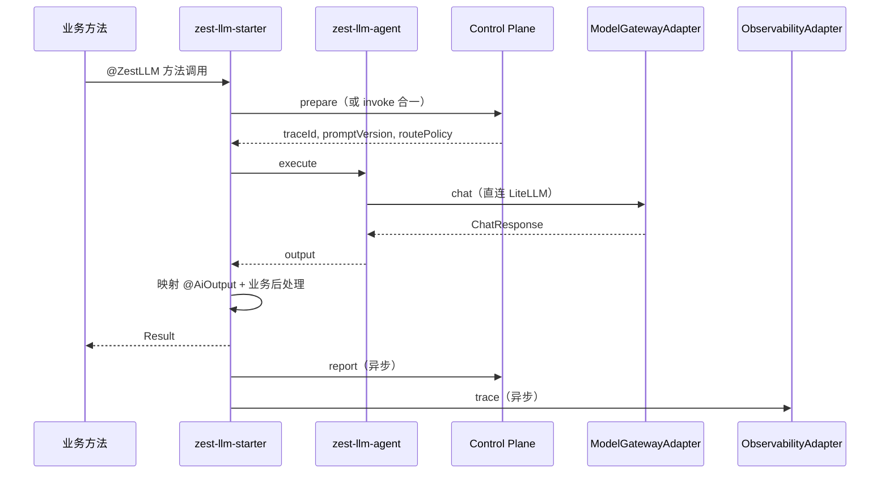

# ZestLLM 系统设计文档

> **版本** 0.2.0-draft · **更新** 2026-06-09 · **状态** 方案评审稿  
> **生态** [ZestFlow](https://www.zestflow.cn) · [Zest 立项交接](./ZestLLM-立项交接.md)  
> **许可证** Apache License 2.0

---

## 目录

- [1. 概述](#1-概述)
- [2. 市面成熟方案对标与选型结论](#2-市面成熟方案对标与选型结论)
- [3. 设计目标、边界与原则](#3-设计目标边界与原则)
- [4. 总体架构](#4-总体架构)
- [5. 可插拔 SPI 设计（核心）](#5-可插拔-spi-设计核心)
- [6. 模块与仓库结构](#6-模块与仓库结构)
- [7. Admin 与 Admin-UI 设计](#7-admin-与-admin-ui-设计)
- [8. 后端分层与阿里规范](#8-后端分层与阿里规范)
- [9. ZestFlow 元件式开发与 MCP 工作流](#9-zestflow-元件式开发与-mcp-工作流)
- [10. 运行时流程](#10-运行时流程)
- [11. API 设计](#11-api-设计)
- [12. 数据模型](#12-数据模型)
- [13. 安全、治理与可观测性](#13-安全治理与可观测性)
- [14. 部署架构](#14-部署架构)
- [15. 版本路线图](#15-版本路线图)
- [附录 A：竞品能力矩阵](#附录-a竞品能力矩阵)
- [附录 B：默认 SPI 实现清单](#附录-b默认-spi-实现清单)

---

## 1. 概述

### 1.1 产品定位

**ZestLLM** 是 Zest 生态中的 **AI 作业调度与治理平台**（LLM Control Plane）。

类比：**XXL-Job** 管「任务调度」，**ZestLLM** 管「AI 调用调度与治理」。

```text
业务声明 AI 作业（code）→ 平台统一执行 Prompt 匹配、模型路由、结果回填与治理
```

### 1.2 与 ZestFlow 的分工

| 平台 | 职责 | 不做 |
|------|------|------|
| **ZestLLM** | 单 AI 作业治理、Prompt/模型/配额/审计 | DAG 编排 |
| **ZestFlow** | 业务 DAG、分支、调度、链 Trace | Prompt 版本、模型路由 |
| **LiteLLM** | 多模型 API 统一、fallback | 企业租户治理 |
| **Langfuse** | Trace、Prompt 实验、评估 | 业务逻辑 |

复杂多 AI 场景：ZestFlow 编排 `ZEST_LLM` 节点，每个节点调用 ZestLLM 的 `code`；简单单 AI 场景：业务直接 `@ZestLLM`。

### 1.3 架构第一原则

```text
治理中心化，执行分布式。
```

- **Control Plane / Admin**：轻量、无状态、管规则与审计，**不转发 token / 流式响应**
- **Execution Plane**：LiteLLM 集群 + 业务侧 Agent，承载推理流量

---

## 2. 市面成熟方案对标与选型结论

### 2.1 对标矩阵（摘要）

| 成熟方案 | 类型 | 许可证 | 借鉴点 | ZestLLM 不直接复用的原因 |
|----------|------|--------|--------|--------------------------|
| **LiteLLM Proxy** | 模型网关 | MIT | 100+ 模型统一 API、fallback、限流 | 缺 Java 注解接入、缺 Prompt 版本运营 |
| **Langfuse** | 可观测 / Prompt Lab | MIT | Trace、成本、Prompt 实验 | 缺运行时调度与 Java 业务接入 |
| **Portkey / Helicone** | 商业网关 + 观测 | 商业 / 部分开源 | 路由策略、缓存、Guardrails | 闭源或 SaaS 绑定，不符合自建治理诉求 |
| **OneAPI** | 国产 API 聚合 | MIT | OpenAI 兼容、渠道管理 | 偏渠道计费，缺作业级治理 |
| **Spring AI** | Java SDK | Apache-2.0 | ChatClient、Tool Calling | 偏 SDK，缺 Control Plane 与运营 UI |
| **XXL-Job** | 任务调度 | GPL-2.0（仅借鉴心智） | 注册、治理、执行日志 | 面向 Cron，非 AI |
| **ZestFlow Admin** | 编排控制台 | Apache-2.0 | Admin + Admin-UI 工程模式、元件扫描 | 面向链编排，非 LLM 治理 |

### 2.2 选型结论：**组装式架构 + 可插拔 SPI**

不自研推理引擎、不重造网关与观测轮子，采用 **「ZestLLM 治理壳 + 成熟开源底座」**：

```text
┌─────────────────────────────────────────────────────────┐
│  ZestLLM（自研 · Apache-2.0）                            │
│  Admin + Admin-UI · Control Plane API · @ZestLLM Starter │
│  SPI 抽象层（可插拔）                                     │
└────────────┬───────────────────────┬────────────────────┘
             │                       │
     ┌───────▼────────┐      ┌───────▼────────┐
     │ LiteLLM (MIT)  │      │ Langfuse (MIT) │
     │ 默认模型网关    │      │ 默认可观测      │
     └────────────────┘      └────────────────┘
             │ 可替换              │ 可替换
     OneAPI / Spring AI      OTel / Noop
```

**原则：**

1. 所有外部底座经 **SPI 接口** 接入，Spring Boot `@ConditionalOnProperty` 切换实现
2. 默认组合可在 `docker-compose` 一键拉起；生产可逐项替换
3. 禁止 AGPL / SSPL 核心依赖；Redis 优先 **Valkey**（BSD-3）

---

## 3. 设计目标、边界与原则

### 3.1 设计目标

| # | 目标 | 验收口径 |
|---|------|----------|
| G1 | 统一 AI 调用治理 | 100% 调用有 traceId + Execution 记录 |
| G2 | 业务低侵入 | `@ZestLLM` 接入 ≤ 0.5 人天 |
| G3 | Prompt 运营化 | 发布/回滚不改业务 JAR |
| G4 | 性能可扩展 | CP P95 < 50ms（不含推理）；推理不经 CP |
| G5 | 底座可替换 | 切换 LiteLLM→OneAPI 仅改配置 + SPI Bean |
| G6 | 工程规范统一 | Spring Boot + MyBatis-Plus + 阿里分层 + ZestFlow 元件规范 |
| G7 | AI 辅助开发 | zestflow-mcp 驱动 Admin 元件脚手架与交付门禁 |

### 3.2 明确不做

- 自研大模型 / 推理引擎
- 通用 Agent / RAG 产品
- ChatBot 平台
- 复杂 DAG 编排（交给 ZestFlow）
- Admin Copilot 生链（ZestFlow Admin 已有，ZestLLM Admin 聚焦 Prompt/模型/Execution）

### 3.3 非功能原则

| 原则 | 说明 |
|------|------|
| Hub 轻量 | Admin 存元数据与治理规则，不存业务链数据 |
| 防腐层 | 所有外部 HTTP 调用经 Adapter，禁止 Controller 直连 LiteLLM |
| 观测旁路 | Langfuse 异步上报，失败不阻断业务 |
| 降级可用 | CP 不可用 + Agent 本地缓存有效 → 允许执行 + 后补 report |

---

## 4. 总体架构

### 4.1 C4 容器图

```text
┌──────────────────── 运维 / 平台管理员 ────────────────────┐
│  zest-llm-admin-ui（Vue3 + Element Plus）                  │
│  Prompt 管理 · 模型路由 · Execution 查询 · 配额 · 成本看板  │
└────────────────────────────┬──────────────────────────────┘
                             │ HTTPS / REST
                             ▼
┌──────────────────── zest-llm-admin ───────────────────────┐
│  Spring Boot 3.2 · MyBatis-Plus · Flyway                   │
│  Admin API + Control Plane Runtime API（同进程，模块分包）   │
│  @ZestComponent 治理元件（可选，供 ZestFlow 编排 Admin 操作）│
└───────┬──────────────────────────────┬─────────────────────┘
        │ prepare / report / invoke     │ 元数据 CRUD
        ▼                               ▼
   MySQL 8                          Valkey（Policy 缓存）
        │
┌───────┴──────────────────────────────────────────────────────┐
│                    业务 Spring Boot 应用                      │
│  zest-llm-starter（@ZestLLM AOP）                             │
│  zest-llm-agent（本地 Prompt/Policy 缓存 + 直连 LiteLLM）      │
│  zestflow-starter（可选 · 多 AI Flow）                        │
└───────┬──────────────────────────────┬───────────────────────┘
        │ ③ execute（重流量）           │ ZEST_LLM 节点
        ▼                               ▼
   LiteLLM Proxy                    ZestFlow Executor
        │                               │
        ▼                               ▼
   各模型 Provider                  Langfuse（Trace 旁路）
```

### 4.2 三段式运行时（v0.2 目标）

| 阶段 | 路径 | 载荷 | 说明 |
|------|------|------|------|
| **prepare** | Agent → CP | 轻 | 返回 traceId、promptVersion、routePolicy |
| **execute** | Agent → LiteLLM | 重 | 实际推理，不经 CP |
| **report** | Agent → CP（异步） | 中 | output + token + cost 落库 |

**MVP v0.1**：可暂用合一接口 `POST /v1/llm/invoke`，v0.2 必须拆分。

### 4.3 Admin 与 Control Plane 部署关系

| 模式 | 说明 | 适用 |
|------|------|------|
| **合一部署（推荐 MVP）** | `zest-llm-admin` 同时暴露 Admin API + Runtime API | 中小团队、单机 Compose |
| **拆分部署（v0.3+）** | `zest-llm-control-plane` 独立无状态集群；Admin 只管配置 | 大流量、CP 水平扩展 |

无论哪种模式，**Runtime API 与 Admin API 共用同一套领域模型与 SPI**，避免双份逻辑。

---

## 5. 可插拔 SPI 设计（核心）

### 5.1 SPI 分层

```text
zest-llm-spi（接口 + 领域模型，无 Spring 依赖）
    ↑ 实现
zest-llm-infra（各 Adapter 实现，Spring @Configuration）
    ↑ 装配
zest-llm-admin / zest-llm-agent / zest-llm-starter
```

### 5.2 核心 SPI 接口

```java
/** 模型网关：LiteLLM / OneAPI / SpringAI */
public interface ModelGatewayAdapter {
    ChatResponse chat(ChatRequest request);
    Stream<ChatChunk> chatStream(ChatRequest request);  // v0.2+
    HealthStatus health();
    String adapterId();  // litellm | oneapi | spring-ai
}

/** 可观测：Langfuse / OpenTelemetry / Noop */
public interface ObservabilityAdapter {
    void traceStart(TraceStartEvent event);
    void traceEnd(TraceEndEvent event);
    String adapterId();
}

/** Prompt 渲染：Handlebars / Mustache / FreeMarker */
public interface PromptRenderer {
    String render(PromptTemplate template, Map<String, Object> variables);
    String rendererId();
}

/** 策略缓存：Valkey / Redis / Caffeine */
public interface PolicyCacheAdapter {
    Optional<RoutePolicy> get(String cacheKey);
    void put(String cacheKey, RoutePolicy policy, Duration ttl);
    void invalidate(String appKey, String code);
}

/** 配额与限流：DB / Redis 令牌桶 / Noop */
public interface QuotaAdapter {
    QuotaDecision check(QuotaContext ctx);
}

/** 审计：DB / Kafka / Noop */
public interface AuditAdapter {
    void audit(AuditEvent event);
}

/** 异步上报通道：Sync / Kafka / RabbitMQ */
public interface ReportChannelAdapter {
    void sendReport(ExecutionReport report);
}

/** 输出校验：JSON Schema / 自定义 Bean Validator */
public interface OutputSchemaValidator {
    ValidationResult validate(Object output, JsonSchema schema);
}
```

### 5.3 Spring Boot 装配约定

```yaml
zest:
  llm:
    adapters:
      model-gateway: litellm          # litellm | oneapi | spring-ai
      observability: langfuse         # langfuse | otel | noop
      prompt-renderer: handlebars     # handlebars | mustache
      policy-cache: valkey            # valkey | redis | caffeine
      quota: redis-token-bucket       # redis-token-bucket | db | noop
      audit: jdbc                     # jdbc | kafka | noop
      report-channel: sync            # sync | kafka | rabbitmq
```

```java
@Configuration
@ConditionalOnProperty(name = "zest.llm.adapters.model-gateway", havingValue = "litellm")
public class LiteLLMGatewayAutoConfiguration {
    @Bean
    public ModelGatewayAdapter modelGatewayAdapter(LiteLLMProperties props) {
        return new LiteLLMGatewayAdapter(props);
    }
}
```

### 5.4 替换场景示例

| 场景 | 配置变更 | 代码变更 |
|------|----------|----------|
| LiteLLM → OneAPI | `model-gateway: oneapi` + URL/Key | 无（仅 infra 模块） |
| 关闭 Langfuse | `observability: noop` | 无 |
| 纯内网无 Redis | `policy-cache: caffeine` | 无 |
| 高并发 report | `report-channel: kafka` | 无 |

### 5.5 SPI 测试策略

- 每个 Adapter 提供 **WireMock / Testcontainers** 集成测试
- 领域服务只依赖 SPI 接口，单元测试注入 **InMemory / Noop** 实现
- Admin UI 的 Provider 探测页调用 `ModelGatewayAdapter.health()`

---

## 6. 模块与仓库结构

```text
zest-llm/                                  # 根 POM · cn.zest.www:zest-llm
├── LICENSE / NOTICE / README.md
├── pom.xml
├── docs/
│   ├── ZestLLM-立项交接.md
│   ├── 系统设计文档.md                     # 本文档
│   ├── 可行性方案文档.md
│   ├── openapi.yaml                       # v0.2+
│   └── THIRD_PARTY_LICENSES.md
├── zest-llm-spi/                          # SPI 接口 + 领域枚举/DTO
├── zest-llm-infra/                        # Adapter 实现（LiteLLM/Langfuse/Valkey…）
├── zest-llm-common/                       # 错误码、统一响应、Trace 上下文
├── zest-llm-admin/                        # Admin + Runtime API（Spring Boot 可执行）
│   └── src/main/java/cn/zest/www/zestllm/admin/
│       ├── controller/                    # Admin REST + Runtime REST
│       ├── service/                       # 领域服务
│       ├── repo/                          # 仓储（防腐）
│       ├── mapper/                        # MyBatis-Plus Mapper
│       ├── model/                         # DO / DTO / VO / Request
│       ├── component/                     # @ZestComponent 治理元件
│       └── config/                        # SPI 装配、Security
├── zest-llm-admin-ui/                     # Vue3 + Vite + Element Plus + TS
├── zest-llm-agent/                        # 业务侧轻量 Agent
├── zest-llm-starter/                      # @ZestLLM 注解 + AOP + AutoConfig
├── zest-llm-flow-adapter/                 # ZestFlow ZEST_LLM 节点（可选）
├── zest-llm-demo/                         # 业务接入 Demo
└── deploy/
    ├── docker-compose.yml                 # PG + Valkey + LiteLLM + Langfuse + Admin
    └── scripts/
        └── init-dev.sh                    # MCP + .zestflow 初始化
```

### 6.1 模块依赖关系

```text
zest-llm-admin-ui  ──build──►  static/ 嵌入 zest-llm-admin

zest-llm-admin
  ├── zest-llm-common
  ├── zest-llm-spi
  ├── zest-llm-infra
  └── zestflow-starter（可选 · Admin 侧 @ZestComponent）

zest-llm-starter
  ├── zest-llm-common
  ├── zest-llm-agent
  └── spring-boot-autoconfigure

zest-llm-flow-adapter
  ├── zest-llm-common
  └── zestflow-executor（provided）
```

---

## 7. Admin 与 Admin-UI 设计

### 7.1 参考范式

对齐 **ZestFlow Admin + Admin-UI** 成熟模式（已在 zestflow 0.2.0 验证）：

| 维度 | ZestFlow 做法 | ZestLLM 对齐 |
|------|---------------|--------------|
| 后端 | `zestflow-admin` Spring Boot 单体 | `zest-llm-admin` |
| 前端 | `zestflow-admin-ui` Vue3 独立工程 | `zest-llm-admin-ui` |
| 集成 | `mvn package` 将 UI dist 复制到 `admin/resources/static` | 同 |
| 鉴权 | JWT + Spring Security | 同 |
| ORM | MyBatis-Plus + Flyway | 同（MySQL 8） |
| 菜单 | 路由 + i18n | 同 |

### 7.2 Admin 功能模块（v0.1 → v0.3）

| 模块 | 页面 | 优先级 | 说明 |
|------|------|--------|------|
| **租户与应用** | 租户列表、App 管理、Token 轮换 | P0 | appKey + tokenHash |
| **AI 作业** | AiTaskDef 列表、code 详情 | P0 | 对应 `@ZestLLM(code)` |
| **Prompt 管理** | 版本列表、编辑器、发布/回滚 | P0 | DRAFT → PUBLISHED |
| **模型路由** | primary/fallback、策略 | P1 | cost_first / quality_first |
| **Execution 查询** | 列表、traceId 详情、关联 Flow | P0 | 审计主界面 |
| **配额** | 日 Token / QPS | P1 | |
| **成本看板** | 按 app/code/model 聚合 | P2 | 可接 Langfuse 数据 |
| **Provider 探测** | LiteLLM 健康、模型列表 | P1 | 调用 SPI health |
| **方法注册** | Starter 上报的 `@ZestLLM` 元数据 | P1 | llm_method_registry |
| **系统设置** | Adapter 开关、全局配置 | P2 | 对应 YAML 可视化 |

### 7.3 Admin-UI 技术栈

| 项 | 选型 |
|----|------|
| 框架 | Vue 3.4 + TypeScript 5.x |
| UI | Element Plus 2.x |
| 构建 | Vite 5.x |
| 状态 | Pinia |
| HTTP | Axios + 统一拦截器 |
| 图表 | ECharts（成本看板） |
| 国际化 | vue-i18n（zh-CN / en） |

### 7.4 Admin API 与 Runtime API 分包

```text
cn.zest.www.zestllm.admin.controller.admin.*   → /api/admin/**   （需 JWT）
cn.zest.www.zestllm.admin.controller.runtime.* → /v1/llm/**       （appToken 鉴权）
cn.zest.www.zestllm.admin.controller.registry.*→ /v1/registry/**  （Starter 注册）
```

---

## 8. 后端分层与阿里规范

### 8.1 分层结构（阿里巴巴 Java 开发手册对齐）

```text
controller   → 参数校验、鉴权注解、VO 转换，禁止业务逻辑
service      → 领域编排、事务边界、调用 SPI
repo         → 聚合 Mapper，屏蔽 MyBatis 细节（参考 zestory / zestflow 实践）
mapper       → MyBatis-Plus BaseMapper + XML（复杂 SQL）
model
  ├── entity/   → DO，与表一一对应，后缀 DO
  ├── dto/      → 层间传输
  ├── vo/       → 返回前端
  └── request/  → 入参 Request，@Valid 校验
config       → Spring 配置、SPI 装配
component    → @ZestComponent 元件（ZestFlow 规范）
```

### 8.2 命名与约定

| 约定 | 示例 |
|------|------|
| 包根 | `cn.zest.www.zestllm` |
| 表前缀 | `llm_` |
| 统一响应 | `Result<T>`（code / message / data / traceId） |
| 异常 | `BusinessException` + `GlobalExceptionHandler` |
| 主键 | 雪花 ID（MyBatis-Plus `IdType.ASSIGN_ID`） |
| 时间 | `LocalDateTime`，DB `datetime` |
| 软删 | `deleted` 字段（可选，v0.2） |
| 日志 | SLF4J，禁止 `System.out` |
| 事务 | Service 层 `@Transactional(rollbackFor = Exception.class)` |

### 8.3 持久化

| 项 | 选型 |
|----|------|
| ORM | MyBatis-Plus 3.5.x |
| 迁移 | Flyway（`db/migration/zestllm/V*.sql`） |
| 数据库 | MySQL 8（元数据 + Execution） |
| 连接池 | HikariCP（Spring Boot 默认） |

### 8.4 禁止项（与 ZestFlow MCP 规范同源）

- Controller 直接访问 Mapper
- Controller 直接调用 LiteLLM / Langfuse HTTP
- 元件（Component）内写 SQL
- AI/MCP 自动修改生产 `application*.yml` 或执行 publish

---

## 9. ZestFlow 元件式开发与 MCP 工作流

### 9.1 为什么引入 ZestFlow 元件规范

ZestLLM Admin 的复杂治理操作（Prompt 发布工作流、批量配额调整、Execution 归档）适合用 **@ZestComponent** 表达为可编排、可观测节点，与 ZestFlow 生态一致；简单 CRUD 仍走 **Controller → Service → Repo** 直链，供 Admin-UI 调用。

**混合模式（推荐）：**

```text
Admin-UI ──REST──► Controller ──► Service ──► Repo     （常规 CRUD）
ZestFlow 链 ──► ZEST_LLM / EXECUTE ──► @ZestComponent   （复杂治理流程，可选）
```

### 9.2 MCP 工具链（zestflow-mcp 0.1.0）

平台 JAR 路径：`~/.zestflow/tools/zestflow-mcp.jar`（用户截图中的发行包）

**项目初始化：**

```bash
# 1. 安装平台 MCP（每台机器一次）
# 参考 zestflow: scripts/dev/install-mcp.ps1

# 2. 在 zest-llm 根目录初始化 Dev 规范
java -jar ~/.zestflow/tools/zestflow-mcp.jar \
  --init-dev --project /path/to/zest-llm \
  --app-code zest-llm-admin \
  --ide cursor
```

**生成物：**

| 文件 | 用途 |
|------|------|
| `.zestflow/rules/architecture.md` | 分层、元件、禁止项（规范源） |
| `.cursor/mcp.json` | Cursor 连接 zestflow MCP |
| `.cursor/rules/zestflow-architecture.md` | Agent 自动加载 |

**开发时 MCP Tools 调用顺序（强制）：**

| 步骤 | Tool | 说明 |
|------|------|------|
| 1 | `search_patterns` | 检索平台 Pattern + 项目蒸馏模式 |
| 2 | `list_components` | 获取已注册元件白名单 |
| 3 | `scaffold_component` | 生成 `@ZestComponent` 脚手架 |
| 4 | `read_project_file` / `search_sources` | 确认包路径与现有代码 |
| 5 | IDE Apply 落盘 | **MCP 不写盘** |
| 6 | `validate_chain` | 若涉及链编排 |
| 7 | `gen_smoke_suite` + `run_acceptance_suite` | 冒烟 |
| 8 | `validate_delivery` | 交付门禁（strictMode score≥0.95） |

### 9.3 Admin 侧元件示例

```java
@ZestComponent("llmPromptHandler")
@RequiredArgsConstructor
public class LlmPromptHandler {

    private final PromptPublishService promptPublishService;

    @ZestExecute(value = "publishPrompt", name = "发布 Prompt 版本")
    public PromptPublishResult publishPrompt(
            @ZestParam("taskCode") String taskCode,
            @ZestParam("version") String version,
            @ZestParam(value = "operator", required = false) String operator) {
        return promptPublishService.publish(taskCode, version, operator);
    }
}
```

### 9.4 Demo 业务侧元件（zest-llm-demo）

与立项交接文档一致，业务 Facade 使用 `@ZestLLM`；Demo 同时引入 `zestflow-starter` 以便 MCP `list_components` 与试验场试跑。

---

## 10. 运行时流程

### 10.1 同步单 AI（@ZestLLM）



### 10.2 多 AI（ZestFlow + ZEST_LLM 节点）

Flow 上下文传递示例见立项交接 §5；`zest-llm-flow-adapter` 实现 ZestFlow `ChainNodeExecutor`，内部调用 Runtime API。

---

## 11. API 设计

### 11.1 Runtime API

| 方法 | 路径 | 说明 | 版本 |
|------|------|------|------|
| POST | `/v1/llm/invoke` | MVP 合一接口 | v0.1 |
| POST | `/v1/llm/prepare` | 鉴权 + prompt + route + traceId | v0.2 |
| POST | `/v1/llm/report` | 异步上报 | v0.2 |
| POST | `/v1/registry/methods` | Starter 注册元数据 | v0.1 |
| GET | `/v1/executions/{traceId}` | 查询执行 | v0.1 |

### 11.2 Admin API（示例）

| 方法 | 路径 | 说明 |
|------|------|------|
| GET | `/api/admin/tasks` | AiTaskDef 分页 |
| POST | `/api/admin/prompts/{code}/versions` | 新建 Prompt 版本 |
| POST | `/api/admin/prompts/{code}/publish` | 发布 |
| GET | `/api/admin/executions` | Execution 分页检索 |
| PUT | `/api/admin/apps/{appKey}/quota` | 配额 |
| GET | `/api/admin/adapters/health` | SPI 健康探测 |
| GET | `/api/admin/dashboard/cost` | 成本聚合 |

### 11.3 错误码

| 错误码 | 说明 |
|--------|------|
| `AUTH_FAILED` | 鉴权失败 |
| `QUOTA_EXCEEDED` | 配额超限 |
| `PROMPT_NOT_FOUND` | 无已发布 Prompt |
| `MODEL_TIMEOUT` | 模型超时（含 fallback 失败） |
| `OUTPUT_SCHEMA_MISMATCH` | 输出不符合 schema |
| `ADAPTER_UNAVAILABLE` | SPI 底座不可用 |

---

## 12. 数据模型

核心 8 表（与立项交接一致，Flyway 管理）：

```text
llm_tenant           租户
llm_app              业务应用（appKey + tokenHash）
llm_ai_task_def      AI 作业（app_id + code 唯一）
llm_prompt_version   Prompt 版本
llm_model_route      模型路由
llm_execution        执行记录
llm_method_registry  Starter 上报元数据
llm_app_quota        配额
```

**Admin 扩展表（v0.2+）：**

```text
llm_audit_log        操作审计
llm_adapter_config   SPI 运行时配置快照（可选）
```

---

## 13. 安全、治理与可观测性

### 13.1 鉴权双轨

| 通道 | 机制 |
|------|------|
| Admin API | JWT（Spring Security） |
| Runtime API | appKey + Bearer appToken（存 hash） |
| Starter 注册 | 独立 registryToken |

### 13.2 可观测分工

| 数据 | 存储 | SPI |
|------|------|-----|
| Execution 明细 | MySQL | AuditAdapter |
| Trace 链路 | Langfuse | ObservabilityAdapter |
| Flow 关联 | ZestFlow chain_event | flowExecutionId 透传 |

### 13.3 Trace ID 体系

```text
flowExecutionId（ZestFlow，可选）
  ├─ nodeExplain  → traceId tr_2001
  ├─ nodeProcess  → traceId tr_2002
  └─ ...
```

---

## 14. 部署架构

### 14.1 docker-compose（最小集）

```text
services:
  mysql:           # ZestLLM 元数据（MySQL 8）
  valkey:          # Policy 缓存
  litellm:         # 模型网关（ModelGatewayAdapter 默认）
  langfuse:        # 观测（可选，ObservabilityAdapter）
  zest-llm-admin:  # Admin + Runtime API + 静态 UI
```

### 14.2 业务应用配置

```yaml
zest:
  llm:
    enabled: true
    control-plane-url: http://zest-llm-admin:8088
    app-key: order-service
    auth-token: ${ZEST_LLM_APP_TOKEN}
    agent:
      enabled: true
      cache-ttl: 300s
    adapters:
      model-gateway: litellm
    litellm-url: http://litellm:4000

zestflow:
  executor:
    admin-addresses: http://zest-llm-admin:8088   # 若 Admin 兼 ZestFlow Hub
    port: 20550
```

---

## 15. 版本路线图

### v0.1 — 可运行 MVP（4~5 周）

- Maven 多模块 + SPI 骨架 + LiteLLM/Noop 适配器
- `zest-llm-admin`：Runtime `invoke` + Execution 落库
- `zest-llm-admin-ui`：Prompt 列表、Execution 查询（最小页）
- `@ZestLLM` Starter + Demo
- docker-compose + MCP init-dev
- Admin CRUD：App、AiTaskDef、Prompt 手工配置

### v0.2 — 薄层化 + 可插拔完善（4~6 周）

- prepare / execute / report 拆分
- LangfuseAdapter、Valkey PolicyCache
- ZEST_LLM Flow 适配器 + 4 步 AI Demo
- Admin-UI：Prompt 发布/回滚、模型路由、Provider 探测

### v0.3 — 治理增强（4 周）

- QuotaAdapter、成本看板
- CP 可独立水平扩展
- Adapter 配置 Admin 可视化

### 验收 KPI

| 指标 | 目标 |
|------|------|
| 业务接入 | ≤ 0.5 人天 |
| Prompt 变更 | 不发业务版 |
| traceId 覆盖 | 100% |
| CP P95（不含推理） | < 50ms |
| fallback 成功率 | > 95% |
| SPI 切换 | 改配置即可，零业务代码变更 |

---

## 附录 A：竞品能力矩阵

| 能力 | LiteLLM | Langfuse | Portkey | Spring AI | ZestLLM |
|------|:-------:|:--------:|:-------:|:---------:|:-------:|
| 多模型网关 | ✅ | ❌ | ✅ | 部分 | ✅ SPI |
| Prompt 版本运营 | 弱 | ✅ | ✅ | ❌ | ✅ |
| Java 注解接入 | ❌ | ❌ | ❌ | ✅ | ✅ |
| 企业配额/审计 | 弱 | 弱 | ✅ | ❌ | ✅ |
| 成本 Trace | 部分 | ✅ | ✅ | ❌ | ✅ SPI |
| Flow 多 AI | ❌ | ❌ | 部分 | ❌ | ✅ ZestFlow |
| Admin UI | 弱 | ✅ | ✅ | ❌ | ✅ |
| 底座可插拔 | 部分 | 部分 | ❌ | N/A | ✅ SPI 一等公民 |
| 开源可自建 | ✅ | ✅ | 部分 | ✅ | ✅ |

---

## 附录 B：默认 SPI 实现清单

| SPI | 默认实现 | Maven 模块 | 替换实现 |
|-----|----------|------------|----------|
| ModelGatewayAdapter | LiteLLMGatewayAdapter | zest-llm-infra | OneAPI、SpringAI |
| ObservabilityAdapter | LangfuseObservabilityAdapter | zest-llm-infra | Otel、Noop |
| PromptRenderer | HandlebarsPromptRenderer | zest-llm-infra | Mustache |
| PolicyCacheAdapter | ValkeyPolicyCacheAdapter | zest-llm-infra | Redis、Caffeine |
| QuotaAdapter | RedisTokenBucketQuotaAdapter | zest-llm-infra | DbQuota、Noop |
| AuditAdapter | JdbcAuditAdapter | zest-llm-infra | KafkaAudit |
| ReportChannelAdapter | SyncReportChannelAdapter | zest-llm-infra | Kafka、RabbitMQ |
| OutputSchemaValidator | JsonSchemaValidator | zest-llm-infra | 自定义 |

---

## 变更记录

| 版本 | 日期 | 说明 |
|------|------|------|
| 0.1.0-draft | 2026-06-09 | 初稿（zestflow/docs 同源） |
| 0.2.0-draft | 2026-06-09 | 增加 Admin/Admin-UI、SPI 可插拔、阿里规范、MCP 工作流 |

---

> **关联文档**：[可行性方案文档](./可行性方案文档.md) · [立项交接](./ZestLLM-立项交接.md)
